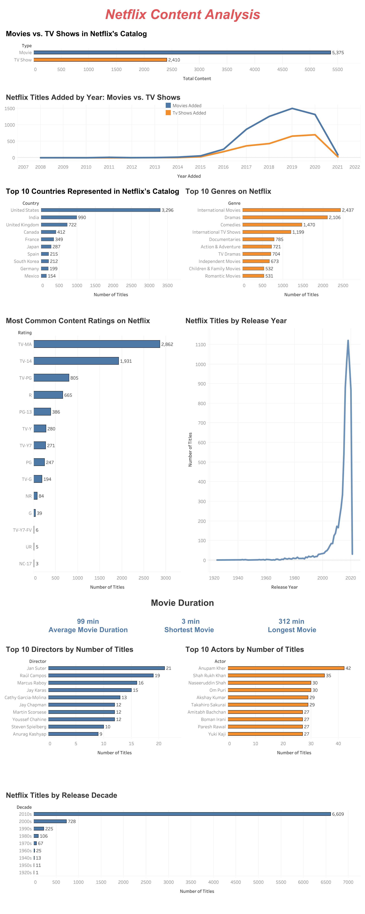

# Netflix Content Analysis

## Project Overview 

This project explores Netflix's content catalog to understand how it has changed over time and what patterns can be found across movies, TV shows, genres, countries, ratings, and release years.

I used SQL in BigQuery to clean and analyze the data, then used Tableau to visualize the results and build an interactive dashboard.

## Business Question

How has Netflix's content catalog evolved, and what insights can we find about its movies and TV shows?

## Dataset

**Source:** [Netflix Movies and TV Shows - Kaggle](https://www.kaggle.com/datasets/shivamb/netflix-shows)

**Original records:** 7,787  
**Records used for analysis:** 7,785

The dataset contains information about Netflix movies and TV shows, including title, content type, country, date added, release year, rating, duration, genre, director, and cast.

During my data quality checks, I found two malformed records. I kept the original data unchanged and excluded invalid records from the analysis when needed.

## Tools Used

- **BigQuery (SQL):** Data cleaning, quality checks, and analysis
- **Tableau:** Data visualization and dashboard creation
- **GitHub:** Project documentation and portfolio presentation

## Data Preparation

Before starting the analysis, I checked the dataset for data-quality issues and prepared the fields needed for analysis.

Some of the steps included:

- Identifying and excluding two malformed records
- Handling missing values where needed
- Converting the `date_added` field into a usable date format
- Splitting fields containing multiple countries, genres, directors, and cast members
- Removing extra spaces from split values
- Converting movie duration into a numeric value for calculations

## Tableau Dashboard

[View the interactive Tableau dashboard](https://10ay.online.tableau.com/#/site/briannambartos-915c67f349/views/NetflixContentAnalysis/Dashboard1?:iid=1)

## Analysis & Key Findings

### 1. Movies vs. TV Shows

**Question:** How many movies vs. TV shows are in Netflix's catalog?

**Results:**
- Movies: 5,375
- TV Shows: 2,410
- Total valid titles: 7,785

**Finding:**  
Movies make up most of Netflix's catalog in this dataset. Out of 7,785 titles, about 69% are movies compared to 31% TV shows.

### 2. Content Added Over Time

**Question:** How many movies and TV shows did Netflix add each year?

**Finding:**  
Netflix added more content each year leading up to 2019, which had the most additions with 2,153 titles. The number stayed pretty high in 2020 with 2,009 titles. There's a big drop in 2021, but the dataset may not include the full year.

### 3. Countries

**Question:** Which countries are represented in the most Netflix titles?

**Finding:**  
The United States is represented the most in Netflix's catalog, with 3,296 titles. That's more than three times the number for India, which comes in second with 990 titles.

*Some titles are associated with more than one country, so country counts can overlap.*

### 4. Genres

**Question:** What are the most common genres in Netflix's catalog?

**Finding:**  
International Movies and Dramas are the two most common genres in the catalog, with 2,437 and 2,106 titles. After those two, there's a noticeable drop to Comedies with 1,470 titles.

*Titles can fall under more than one genre, so genre counts can overlap.*

### 5. Content Ratings

**Question:** What are the most common content ratings in Netflix's catalog?

**Finding:**  
TV-MA is the most common rating in the catalog with 2,862 titles, followed by TV-14 with 1,931. This shows that a large amount of the content in this dataset is aimed at mature and teen audiences.

### 6. Release Years

**Question:** Which release years have the most titles in Netflix's catalog?

**Finding:**  
Most of the titles were released during the 2010s, with the numbers staying pretty high from 2016 through 2020. 2018 stands out as the biggest year, with 1,121 titles.

### 7. Movie Duration

**Question:** What is the average movie duration in Netflix's catalog?

**Finding:**  
Movies in the catalog average about 99 minutes, or a little over an hour and a half. There's also a pretty big range in movie length, from just 3 minutes to 312 minutes.

### 8. Directors

**Question:** Which directors have the most titles in Netflix's catalog?

**Finding:**  
The top 10 directors have around 14 titles each on average. Jan Suter has the most with 21 titles, followed closely by Raúl Campos with 19.

### 9. Actors

**Question:** Which actors appear in the most titles in Netflix's catalog?

**Finding:**  
Anupam Kher appears in the most titles with 42, followed by Shah Rukh Khan with 35. Most of the other actors in the top 10 are pretty close, appearing in around 27–30 titles.

### 10. Release Decades

**Question:** Which decades are most represented in Netflix's catalog?

**Finding:**  
This supports what we saw in the release year data. Most of the catalog is made up of newer content, with 6,609 titles released in the 2010s compared to only 728 in the 2000s.

## Overall Conclusion

Overall, the data shows that Netflix's catalog is mostly made up of movies and newer content. Movies account for about 69% of the titles analyzed, and most titles were released during the 2010s. Netflix also added more content leading up to 2019, which had the highest number of additions in the dataset.

The catalog includes content from many countries and genres, but the United States has the most representation, while International Movies and Dramas are the most common genres. Overall, the catalog grew heavily during the late 2010s and became a large, internationally represented collection that leans more toward movies and newer releases.
